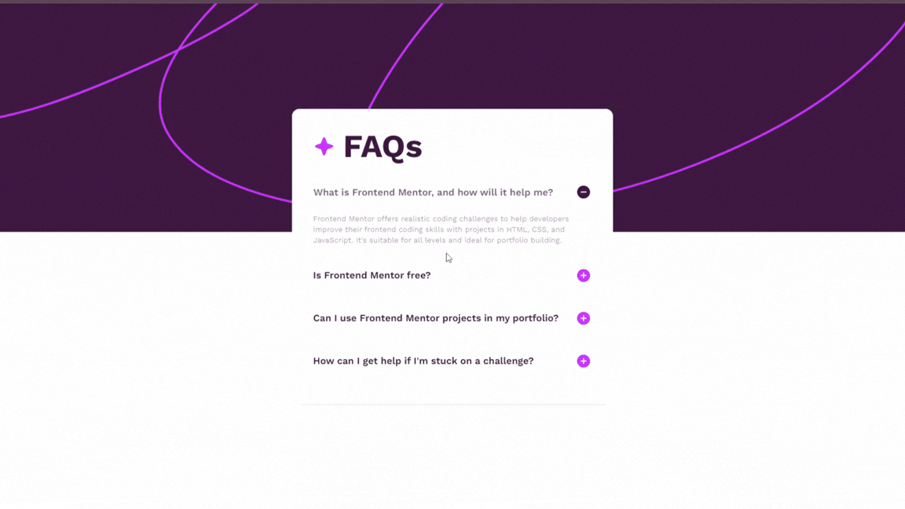
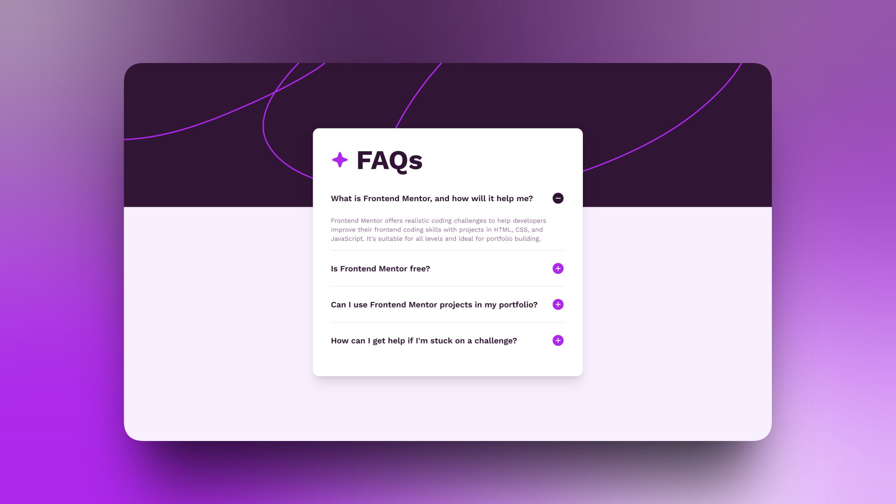

# Frontend Mentor - FAQ accordion solution

This is a solution to the [FAQ accordion challenge on Frontend Mentor](https://www.frontendmentor.io/challenges/faq-accordion-wyfFdeBwBz). Frontend Mentor challenges help you improve your coding skills by building realistic projects.



## Table of contents

- [Overview](#overview)
  - [The challenge](#the-challenge)
  - [Screenshot](#screenshot)
  - [Links](#links)
- [My process](#my-process)
  - [Built with](#built-with)
  - [What I learned](#what-i-learned)
  - [Useful resources](#useful-resources)
- [Author](#author)

## Overview

### The challenge

Users should be able to:

- Hide/Show the answer to a question when the question is clicked
- Navigate the questions and hide/show answers using keyboard navigation alone
- View the optimal layout for the interface depending on their device's screen size
- See hover and focus states for all interactive elements on the page

### Screenshot

📱 Preview 💻



### Links

- Solution URL: [https://www.frontendmentor.io/solutions/faq-accordion---nextjs-tailwind-shadcn-WXqAy25ymf](https://www.frontendmentor.io/solutions/faq-accordion---nextjs-tailwind-shadcn-WXqAy25ymf)
- Live Site URL: [https://fermop-faq-accordion-nextjs.vercel.app/](https://fermop-faq-accordion-nextjs.vercel.app/)

## My process

### Built with

- Semantic HTML5 markup
- CSS custom properties (Tailwind v4 Theme)
    - Flexbox
    - Tailwind CSS - For styling
- Mobile-first workflow
- [React](https://es.react.dev/) - JS library
- [Next.js](https://nextjs.org/) - React framework
- [Shadcn](https://ui.shadcn.com/docs/components/radix/accordion) - Accordion Component (type="multiple")

### What I learned

This project was my first time working with **shadcn/ui** components and integrating them into a Next.js environment with Tailwind CSS.

One of the main challenges was customizing the `Accordion` component to replace the default chevron icon with the specific Plus (+) and Minus (-) icons required by the design, and making them toggle based on the open/closed state.

I learned how to use Tailwind's `group` and `data-attributes` to style children elements based on their parent's state:

```tsx
/* src/components/ui/accordion.tsx */
<AccordionPrimitive.Trigger
  className="flex ... group" // Added 'group' to the parent
>
  {children}
  <div className="shrink-0">
    {/* Using group-data-[state=open] to toggle visibility */}
    <Image 
      src="/assets/images/icon-plus.svg" 
      className="block group-data-[state=open]:hidden" 
    />
    <Image 
      src="/assets/images/icon-minus.svg" 
      className="hidden group-data-[state=open]:block" 
    />
  </div>
</AccordionPrimitive.Trigger>
```

### Useful resources

- [Shadcn](https://ui.shadcn.com) - This library helped me manage the logic for the accordion component.

## Author

- Frontend Mentor - [@fermop](https://www.frontendmentor.io/profile/fermop)
- Linkedin - [Fernando Pérez Mojica](https://www.linkedin.com/in/fernando-pérez-mojica-71b28a361)
